  <!-- Editorial Mathematical Header -->
  

  

  

    
    
    
  

---

### Overview & Focus

Focused on **Applied Statistics, Actuarial Mathematics, Stochastic Modeling, and Quantitative Machine Learning**. Experienced in multi-criteria decision making (Best-Worst Method), credit risk scoring architectures, deep learning pipelines, geospatial verification (NDVI), and computational statistical programming in R and Python.

- **Trainee / Intern** at *OJK Institute (OJKI)*, Directorate of Human Capital Competency Development.
- **Undergraduate Statistics Student** at *Universitas Diponegoro* (Faculty of Science and Mathematics).
- **Lead Researcher & Author** for the *ESG-Integrated Bimodal Credit Scoring (ESG-BCS)* framework for OJK Innovation Paper 2026.
- **Core Focus**: Actuarial Risk Analysis, Multi-Criteria Optimization (BWM), Neural Architectures, and Econometric Modeling.

---

### Featured Research & Repositories

| Repository / Project | Tech Stack | Highlights |
| :--- | :--- | :--- |
| [**bcs-esg-prototype**](https://github.com/geovanybramanthya-bot/bcs-esg-prototype) | `Python` `R` `SciPy` `Best-Worst Method (BWM)` `NDVI` `TailwindCSS` | ESG-Integrated Bimodal Credit Scoring prototype for OJK Innovation Paper 2026. Dual-path evaluation system combining conventional credit vectors with ESG composite scores. Features Data-Thin (alpha 0.70 / beta 0.30) and Data-Rich (alpha 0.40 / beta 0.60) calibration, geospatial NDVI farmland verification, and social capital metrics. |
| [**conjunet**](https://github.com/geovanybramanthya-bot/conjunet) | `Python` `PyTorch` `NetworkX` `Graph Neural Networks` | Deep relational graph and topological network analysis. Implements structured node representation learning, dynamic connectivity modeling, and feature propagation across heterogeneous graphs. |
| [**Actuarial-Life-Contingencies**](https://github.com/geovanybramanthya-bot) | `R` `RStudio` `LaTeX` | Computational life insurance mathematics and actuarial modeling toolkit in R. Covers multiple decrement models, commutation tables, net level premium calculation, and stochastic reserve projections. |
| [**Stochastic-Processes-Lab**](https://github.com/geovanybramanthya-bot) | `Python` `NumPy` `Statsmodels` `SciPy` | Numerical simulation platform for discrete and continuous Markov processes, Poisson jump diffusions, and stochastic differential equations with financial risk applications. |

---

### Computational Stack & Tools

  

---

### GitHub Analytics & Metrics

  
  

   

  

---

  

